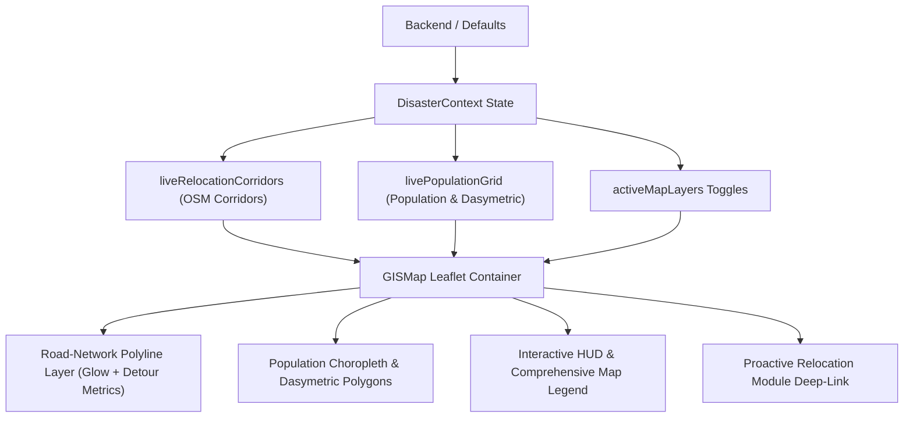

# Implementation Plan: OSM Road-Network Relocation Corridors & Population Distribution Overlay

## Goal Description
Enhance the frontend GIS mapping engine and disaster decision matrix to:
1. **Render Authentic OSM Road-Network Relocation Corridors**: Replace straight-line Euclidean vectors with realistic, road-following corridors along OpenStreetMap highways (NH, SH, and arterials) that actively detour around dynamic red hazard zones. Ensure high-contrast, visually prominent map rendering with transit metrics (road distance, transit time, convoy speed, detour ratio, and zero red-zone overlap status).
2. **Toggleable Population Distribution & Dasymetric Grid Overlay**: Introduce a toggleable spatial grid layer displaying multi-tier population density. For data-sparse sectors lacking direct telemetry, visually demarcate and explain the **Dasymetric Settlement Estimation Model** (modeled from OSM residential footprints and terrain slope $<15^\circ$) with confidence ratings and demographic vulnerability breakdowns.
3. **Fix TypeScript Type Definitions**: Align `frontend/src/types/index.ts` with newly introduced backend and default data schemas so that `npm run build` compiles cleanly with zero errors.

---

## User Review Required

> [!IMPORTANT]
> **Key Architecture Decisions for Review:**
> 1. **Relocation Corridor Visual Styling**: Corridors will be rendered as high-visibility, glowing multi-layer polylines (dark contrast casing underlay + vibrant urgency-colored top stroke: `#DC2626` for Immediate, `#EA580C` for Short-Term, `#0284C7` for Strategic Watch) with animated flow pulses and interactive popups comparing Road Distance vs Straight-Line Euclidean Distance.
> 2. **Data-Sparse Population Demarcation**: Gridded population cells with direct sensor telemetry will display solid borders and high-confidence metrics ($96\%$), while data-sparse cells estimated via dasymetric modeling will display dashed borders (`dashArray: '4, 4'`), amber warning badges, and explicit data provenance notes explaining the OSM footprint + slope proxy.
> 3. **Layer Toggle Controls**: Both layers will be accessible via the main GIS Layers Manager dropdown and quick-access HUD pills on the top of the map.

---

## Proposed Changes



---

### Component 1: Frontend Type Definitions & Build Fixes

#### [MODIFY] [types/index.ts](file:///home/shaurya/Documents/SIH26191/frontend/src/types/index.ts)
- Extend `CriticalInfrastructure`, `EvacuationRoute`, `HazardCategory`, `DataSourceTelemetry`, and `GeoJSONFeatureCollection` to support flexible string unions and new routing/population attributes.
- Ensure `npm run build` succeeds without type errors.

```typescript
// Key updates in types/index.ts:
export interface EvacuationRoute {
  id: string;
  code?: string;
  name: string;
  fromZone?: string;
  toShelter?: string;
  coordinates: [number, number][];
  distanceKm?: number;
  euclideanDistanceKm?: number;
  detourRatio?: number;
  estimatedTransitMins?: number;
  clearanceStatus?: 'CLEAR' | 'CONGESTED' | 'BLOCKED' | 'CAUTION' | string;
  status?: 'CLEAR' | 'CONGESTED' | 'BLOCKED' | 'CAUTION' | string;
  osmHighwayClass?: string;
  roadCapacityVehiclesPerHour?: number;
  transitCapacityPerHour?: number;
  currentFlowPerHour?: number;
  bottleneckLocation?: string;
  ndrfEscortAssigned?: boolean;
  alternativeRouteAvailable?: boolean;
  hazardAvoidance?: string;
  roadSegments?: any[];
}

export interface GeoJSONFeatureCollection {
  type: 'FeatureCollection';
  name?: string;
  crs?: any;
  total_count?: number;
  total_corridors?: number;
  total_cells?: number;
  total_grid_population?: number;
  sparse_data_cells_count?: number;
  dasymetric_model_active?: boolean;
  data_resolution?: string;
  coverage_radius_km?: number;
  district_id?: string;
  features: GeoJSONFeature[];
  [key: string]: any;
}
```

---

### Component 2: GIS Map UI & Leaflet Renderers

#### [MODIFY] [GISMap.tsx](file:///home/shaurya/Documents/SIH26191/frontend/src/components/gis/GISMap.tsx)
- Destructure `liveRelocationCorridors`, `livePopulationGrid`, and `isPopulationLoading` from `useDisaster()`.
- Add **OSM Road Relocation Corridors Layer**:
  - Render dual-pass polyline: wider dark underlay for contrast against dark/satellite/topo tiles, plus vibrant foreground line styled by priority tier.
  - Interactive popup with origin, target safe site, road vs straight line distance, detour factor, transit speed, convoy time, and "100% Hazard-Bypassed" badge.
- Add **Population Distribution & Dasymetric Grid Layer**:
  - Render polygon grid with opacity and color coding matching density tiers (`EXTREME`, `VERY_HIGH`, `HIGH`, `MODERATE`, `LOW`).
  - Differentiate dasymetric estimated cells with dashed borders and dedicated badges.
  - Interactive popup showing demographic breakdowns (Elderly, Children, PwD, Livestock), confidence score, data provenance, and evacuation priority.
- Update **Layers Menu** to include toggle switches for `relocationCorridors` and `populationHeatmap`.
- Add **Quick HUD Toggles** on top of the map for instant switching.
- Expand **Map Legend** at bottom left with tabs/expandable sections for Hazard Severity, Road Corridors, and Population Density.

---

### Component 3: Proactive Relocation Module Integration

#### [MODIFY] [ProactiveRelocationModule.tsx](file:///home/shaurya/Documents/SIH26191/frontend/src/components/decision/ProactiveRelocationModule.tsx)
- Enhance recommendation cards to display OSM road routing metadata (Road Name, Transit Distance vs Euclidean Distance, Highway Class, and Hazard Bypass status).
- Add quick action button to inspect the road corridor directly on the interactive GIS map.

---

## Verification Plan

### Automated Tests
1. **Frontend Typecheck & Build**:
   ```bash
   cd frontend && npm run build
   ```
2. **Backend Services Verification**:
   ```bash
   /home/shaurya/Documents/SIH26191/.venv/bin/python3 -c "from app.services.spatial_pipeline_service import spatial_pipeline_service; print('Corridors:', len(spatial_pipeline_service.get_relocation_corridors()['features'])); print('Pop cells:', len(spatial_pipeline_service.get_population_distribution()['features']))"
   ```

### Manual Verification
1. Open the GIS Map (`#risk_map` or incident command center) and inspect:
   - **OSM Road Corridors**: Verify that relocation paths follow serpentine mountain highway roads instead of straight Euclidean lines between habitations and safe sites, and detour around red zones.
   - **Popups on Corridors**: Click on a corridor to verify road distance, Euclidean distance, detour ratio, transit time, and hazard bypass confirmation.
   - **Population Overlay Toggle**: In the Layers menu (or HUD), toggle "Population Distribution & Dasymetric Grid" ON. Verify colored grid squares appear.
   - **Dasymetric Cells**: Click on an outer ridge / data-sparse grid cell to verify it shows the "DASYMETRIC ESTIMATION" tag, demographic breakdown, and explanation of OSM residential footprint & slope proxy.
   - **Basemap Compatibility**: Switch between Dark Command, ISRO Satellite, and Topographic basemaps to ensure lines and grid cells remain clearly legible.
